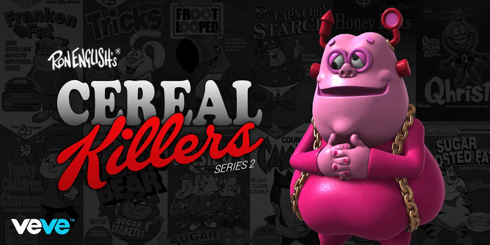

  <a href="../index.html">Home</a>
  <a href="../solo-exhibitions.html">Solo exhibitions</a>
  <a href="../group-exhibitions.html">Group exhibitions</a>
  <a href="../murals-and-street-works.html">Murals &amp; street works</a>
  <a href="../pop-ups-shops-brand-activations.html">Pop-ups, shops &amp; brand activations</a>
  <a href="../benefit-auctions-charity-projects.html">Benefit auctions &amp; charity projects</a>
  <a href="../film-screenings-festivals-film-events.html">Film screenings, festivals &amp; film events</a>
  <a href="../digital-projects-nft-crypto-art.html">Digital projects, NFT &amp; crypto-art</a>
  <a href="../public-talks-lectures-book-signings.html">Public talks, lectures &amp; book signings</a>
  <a href="../special-events-parties-tours.html">Special events, parties &amp; tours</a>

[⬅ Back to digital projects index](../digital-projects-nft-crypto-art.html#cereal-killers-series-2-2022-row)

# 2022 – Ron English — *Cereal Killers Series 2* (Digital Trading Cards)

**Year:** 2022  
**Platform:** Digital trading card NFT platforms  
**Type:** Digital collectible card set (animated + static variants)

## Overview

Building on the momentum of the first series, **“Cereal Killers Series 2”** expands the roster with new characters and deeper Popaganda world-building. The drop continues Ron English’s parody of cereal-box mascots, adding new villains, corrupted heroes and sugary anti-icons to the evolving lineup. Series 2 introduced refined animations, higher-resolution sculpts and expanded lore elements that later informed additional NFT releases and physical vinyl figures.

Collectors view Series 2 as the moment when the *Cereal Killers* digital universe matured—offering sharper satire, improved production quality and stronger continuity across characters. Many cards from this series remain among the most traded within the broader Popaganda NFT ecosystem.

## Gallery

*(Add additional views if available, e.g. `cerealkillers2-card2.webp`, `cerealkillers2-detail.webp`.)*

## Sources

- [OpenSea – “Cereal Killers Series 2” NFTs](https://opensea.io/collection/cerealkillersseries2)  
- [Popaganda — Cereal Killers archive](https://www.popaganda.com/cereal-killers/)  
