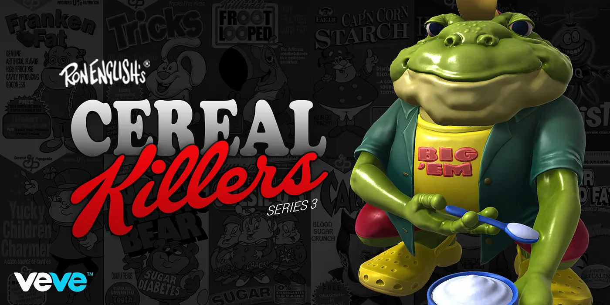

  <a href="../index.html">Home</a>
  <a href="../solo-exhibitions.html">Solo exhibitions</a>
  <a href="../group-exhibitions.html">Group exhibitions</a>
  <a href="../murals-and-street-works.html">Murals &amp; street works</a>
  <a href="../pop-ups-shops-brand-activations.html">Pop-ups, shops &amp; brand activations</a>
  <a href="../benefit-auctions-charity-projects.html">Benefit auctions &amp; charity projects</a>
  <a href="../film-screenings-festivals-film-events.html">Film screenings, festivals &amp; film events</a>
  <a href="../digital-projects-nft-crypto-art.html">Digital projects, NFT &amp; crypto-art</a>
  <a href="../public-talks-lectures-book-signings.html">Public talks, lectures &amp; book signings</a>
  <a href="../special-events-parties-tours.html">Special events, parties &amp; tours</a>

[⬅ Back to digital projects index](../digital-projects-nft-crypto-art.html#cereal-killers-series-3-2021-row)

# 2021 – Ron English — *Cereal Killers Series 3* (VeVe)

**Year:** 2021 (drop date November 27, 2021)  
**Platform:** VeVe app – “Cereal Killers S3”  
**Type:** 3D digital collectible blind-box series  

## Overview

**“Cereal Killers Series 3”** pushes Ron English’s breakfast-mascot satire even further inside VeVe. This wave introduces four new figures—**Smack, Crack & Pot**, **Drug ’em Killfrog**, **Qhrist** and **Tricky the Obese Bunny**—each rendered as a full 3D sculpt with the same toy-like presence as English’s physical vinyl line. The drop arrives as a blind box, so collectors discover which mascot they’ve pulled only after the reveal.

By the third series, the *Cereal Killers* corner of VeVe feels like a full franchise: returning collectors can build out long rows of grotesque cereal icons, while new users meet some of English’s most biting characters for the first time in digital form. The release also deepens the narrative link between VeVe’s Popaganda line and English’s ongoing critique of advertising, sugar culture and consumer excess.

## Gallery

*(Add additional views if available, e.g. `cereal3-alt.webp`, `cereal3-detail.webp`.)*

## Sources

- [VeVe blog – “Ron English — Cereal Killers S3”](https://medium.com/veve-collectibles/ron-english-cereal-killers-s3-163b12df9ddc)  
- [VeVe Collectibles – “Cereal Killers – S3” series page](https://www.veve.me/collectibles/en/series/3784024f-a799-4821-b9b9-d68ac548e443)  
