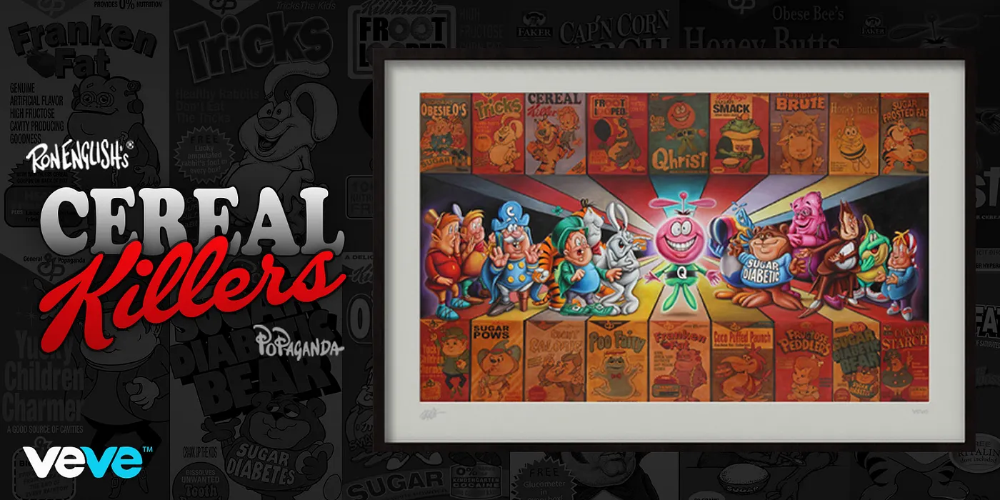

  <a href="../index.html">Home</a>
  <a href="../solo-exhibitions.html">Solo exhibitions</a>
  <a href="../group-exhibitions.html">Group exhibitions</a>
  <a href="../murals-and-street-works.html">Murals &amp; street works</a>
  <a href="../pop-ups-shops-brand-activations.html">Pop-ups, shops &amp; brand activations</a>
  <a href="../benefit-auctions-charity-projects.html">Benefit auctions &amp; charity projects</a>
  <a href="../film-screenings-festivals-film-events.html">Film screenings, festivals &amp; film events</a>
  <a href="../digital-projects-nft-crypto-art.html">Digital projects, NFT &amp; crypto-art</a>
  <a href="../public-talks-lectures-book-signings.html">Public talks, lectures &amp; book signings</a>
  <a href="../special-events-parties-tours.html">Special events, parties &amp; tours</a>

[⬅ Back to digital projects index](../digital-projects-nft-crypto-art.html#last-fat-breakfast-2021-row)

# 2021 – Ron English — *Last Fat Breakfast* (VeVe)

**Year:** 2021 (drop date December 31, 2021)  
**Platform:** VeVe – Popaganda / Cereal Killers  
**Type:** Premium digital print (New Year’s Eve special drop)  

## Overview

Released as a **New Year’s Eve special** on VeVe, **“Last Fat Breakfast”** translates one of Ron English’s best-known Popaganda paintings into a high-end digital collectible. The work reimagines Leonardo da Vinci’s *Last Supper* as an overstuffed junk-food feast, populated by the mascot cast of English’s *Cereal Killers* universe. On VeVe, the image appears as a premium digital print that ties directly into the growing line of *Cereal Killers* 3D figures.

The drop serves as both a capstone and a teaser: it nods to the expanding Cereal Killers roster while foreshadowing later projects like the *Cereal Killers S4* “Last Supper” set and the 3D *Last Supper Diorama*. For many collectors, this release became the key “cover image” for understanding how the breakfast mascots, religious parody and consumer critique all intersect in English’s work.

## Gallery

*(Add additional views if available, e.g. `lastfat-detail.webp`, `lastfat-wallview.webp`.)*

## Sources

- [VeVe blog – “Ron English — Last Fat Breakfast”](https://medium.com/veve-collectibles/ron-english-last-fat-breakfast-d74dbe2635ee)  
