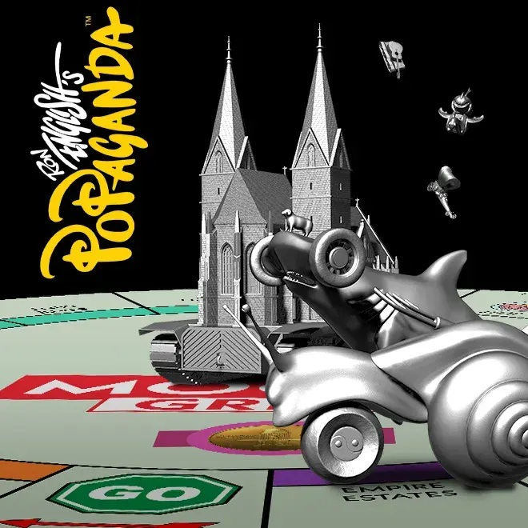

  <a href="../index.html">Home</a>
  <a href="../solo-exhibitions.html">Solo exhibitions</a>
  <a href="../group-exhibitions.html">Group exhibitions</a>
  <a href="../murals-and-street-works.html">Murals &amp; street works</a>
  <a href="../pop-ups-shops-brand-activations.html">Pop-ups, shops &amp; brand activations</a>
  <a href="../benefit-auctions-charity-projects.html">Benefit auctions &amp; charity projects</a>
  <a href="../film-screenings-festivals-film-events.html">Film screenings, festivals &amp; film events</a>
  <a href="../digital-projects-nft-crypto-art.html">Digital projects, NFT &amp; crypto-art</a>
  <a href="../public-talks-lectures-book-signings.html">Public talks, lectures &amp; book signings</a>
  <a href="../special-events-parties-tours.html">Special events, parties &amp; tours</a>

[⬅ Back to digital projects index](../digital-projects-nft-crypto-art.html#mogul-grin-board-game-2025-row)

# 2025 – Ron English’s Mogul Grin Board Game (VeVe)

**Year:** 2025 (drop date March 15, 2025)  
**Platform:** VeVe app – “Mogul Grin Board Game”  
**Type:** Digital board-game environment + phygital NFT set  

## Overview

The **“Mogul Grin Board Game”** drop turns Ron English’s finance-obsessed skull character into the center of a playable digital world. Instead of just releasing another figure, VeVe rolled out a full game board environment, complete with **Cathedral Tank**, modular roads and craftable car and tank pieces that slot into the layout. Collectors assemble the components through a mix of primary purchases and in-app crafting, gradually building out a Popaganda-style dystopian city ruled by Mogul Grin.

The release is framed as a **phygital** project: the NFTs map onto a real-world board-game concept developed with English, hinting at future physical editions while using VeVe’s AR tools to preview how the environment might look on an actual tabletop. The drop pushes beyond character collectibles into world-building, giving Mogul Grin a dedicated setting that can expand over multiple series.

## Gallery

*(Add additional views if available, e.g. `boardgame1-2.jpg`, `boardgame1-detail.jpg`.)*

## Sources

- [VeVe blog – “Ron English — Mogul Grin Board Game”](https://blog.veve.me/post/ron-english----mogul-grin-board-game)  
- [VeVe Collectors – “Ron English Mogul Grin Board Game Series 2 / overview of the board game line”](https://vevecollectors.com/blog/ron-english-mogul-grin-board-game-series-2/)  
