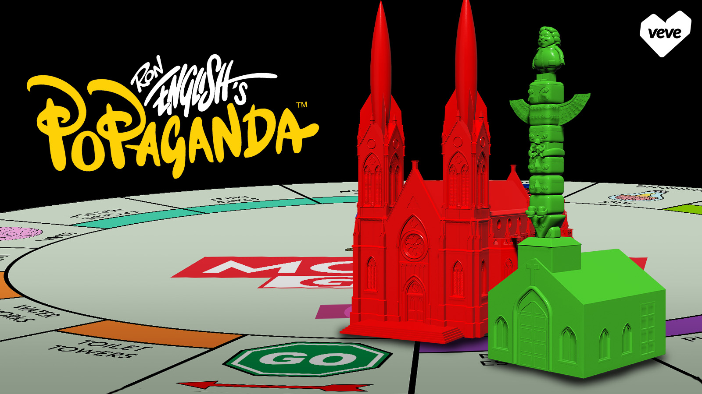

  <a href="../index.html">Home</a>
  <a href="../solo-exhibitions.html">Solo exhibitions</a>
  <a href="../group-exhibitions.html">Group exhibitions</a>
  <a href="../murals-and-street-works.html">Murals &amp; street works</a>
  <a href="../pop-ups-shops-brand-activations.html">Pop-ups, shops &amp; brand activations</a>
  <a href="../benefit-auctions-charity-projects.html">Benefit auctions &amp; charity projects</a>
  <a href="../film-screenings-festivals-film-events.html">Film screenings, festivals &amp; film events</a>
  <a href="../digital-projects-nft-crypto-art.html">Digital projects, NFT &amp; crypto-art</a>
  <a href="../public-talks-lectures-book-signings.html">Public talks, lectures &amp; book signings</a>
  <a href="../special-events-parties-tours.html">Special events, parties &amp; tours</a>

[⬅ Back to digital projects index](../digital-projects-nft-crypto-art.html#mogul-grin-board-game-series-2-2025-row)

# 2025 – Ron English’s Mogul Grin Board Game — Series 2 (VeVe)

**Year:** 2025 (drop date April 5, 2025)  
**Platform:** VeVe app – “Mogul Grin Board Game Series 2”  
**Type:** Digital board-game expansion set (environment pieces; MCP-focused drop)  

## Overview

**“Mogul Grin Board Game — Series 2”** expands the Mogul Grin game world with a new wave of environment pieces. Instead of characters or vehicles, this drop focuses on architecture: **Green House**, **Red House**, **Thought Factory** and related structures released in blind-box format. Collectors add these buildings to the existing Mogul Grin Board Game layout, turning the earlier streets and Cathedral Tank into a denser Popaganda cityscape.

VeVe framed Series 2 as a key step for **Master Collector Program** progress, offering bonuses and set-completion rewards for collectors who assembled the full lineup of buildings. The drop reinforces the idea of Mogul Grin as more than a single figure: it’s a flexible universe of props, spaces and power-symbols that can be rearranged on a digital game board and, eventually, mirrored in physical form.

## Gallery

*(Add additional views if available, e.g. `boardgame2-2.jpg`, `boardgame2-detail.jpg`.)*

## Sources

- [VeVe blog – “Ron English — Mogul Grin Board Game Series 2”](https://blog.veve.me/post/ron-english-mogul-grin-board-game-series-2)  
- [VeVe Official on X – Series 2 announcement / teaser](https://twitter.com/veve_official/status/1786230917440385148)  
