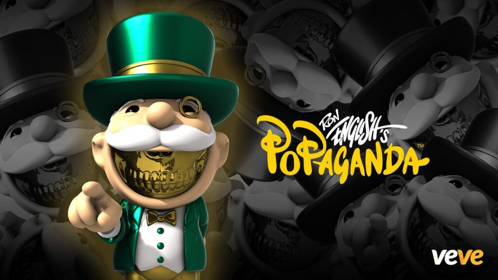

  <a href="../index.html">Home</a>
  <a href="../solo-exhibitions.html">Solo exhibitions</a>
  <a href="../group-exhibitions.html">Group exhibitions</a>
  <a href="../murals-and-street-works.html">Murals &amp; street works</a>
  <a href="../pop-ups-shops-brand-activations.html">Pop-ups, shops &amp; brand activations</a>
  <a href="../benefit-auctions-charity-projects.html">Benefit auctions &amp; charity projects</a>
  <a href="../film-screenings-festivals-film-events.html">Film screenings, festivals &amp; film events</a>
  <a href="../digital-projects-nft-crypto-art.html">Digital projects, NFT &amp; crypto-art</a>
  <a href="../public-talks-lectures-book-signings.html">Public talks, lectures &amp; book signings</a>
  <a href="../special-events-parties-tours.html">Special events, parties &amp; tours</a>

[⬅ Back to digital projects index](../digital-projects-nft-crypto-art.html#mogul-grin-series-1-2023-row)

# 2023 – Ron English — Mogul Grin Series 1 (VeVe)

**Year:** 2023 (drop date September 29, 2023)  
**Platform:** VeVe app – “Mogul Grin Series 1”  
**Type:** Digital collectible blind-box series (3D sculptures; NYCC con exclusive)  

## Overview

**“Mogul Grin Series 1”** introduces Ron English’s *Mogul Grin* character to VeVe as a self-contained mini–character line. The drop arrives as a New York Comic Con–themed release: collectors attending the official VeVe / Popaganda party could receive an invite tied to the series, while the blind-box in the app delivered one of three sculpt variants—**Black Tie**, **Greed Green** and **Gold Skull**.  

Each version takes the trademark Popaganda skull-and-grin motif and fuses it with the swagger of a finance-world power broker, complete with tailored suit and over-the-top attitude. The combination of con-exclusive framing, limited editions and multiple rarities helped position *Mogul Grin* as a flagship VeVe–native character within English’s broader digital universe.

## Gallery

*(Add additional views if available, e.g. `mogul-2.jpg`, `mogul-detail.jpg`.)*

## Sources

- [VeVe blog – “Ron English — Mogul Grin Series 1”](https://blog.veve.me/post/ron-english-mogul-grin)  
- [VeVe France – “Ron English — Mogul Grin Series 1” (drop details, editions and rarities)](https://vevefrance.fr/blog/ron-english-mogul-grin-series-1/)  
