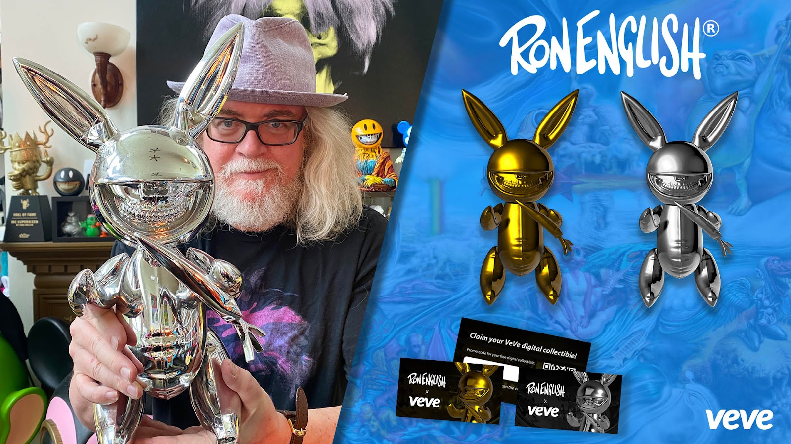

  <a href="../index.html">Home</a>
  <a href="../solo-exhibitions.html">Solo exhibitions</a>
  <a href="../group-exhibitions.html">Group exhibitions</a>
  <a href="../murals-and-street-works.html">Murals &amp; street works</a>
  <a href="../pop-ups-shops-brand-activations.html">Pop-ups, shops &amp; brand activations</a>
  <a href="../benefit-auctions-charity-projects.html">Benefit auctions &amp; charity projects</a>
  <a href="../film-screenings-festivals-film-events.html">Film screenings, festivals &amp; film events</a>
  <a href="../digital-projects-nft-crypto-art.html">Digital projects, NFT &amp; crypto-art</a>
  <a href="../public-talks-lectures-book-signings.html">Public talks, lectures &amp; book signings</a>
  <a href="../special-events-parties-tours.html">Special events, parties &amp; tours</a>

[⬅ Back to digital projects index](../digital-projects-nft-crypto-art.html#rabbit-grin-series-2025-row)

# 2025 – Ron English — *Rabbit Grin Series* (DesignerCon Hong Kong)

**Year:** 2025 (drop date July 12, 2025)  
**Platform:** VeVe – DesignerCon HK Exclusive  
**Type:** Limited-edition digital sculpture series (blind-box; event-exclusive)  

## Overview

Released during **DesignerCon Hong Kong 2025**, the *Rabbit Grin Series* brings one of Ron English’s classic Popaganda animal hybrids into the VeVe ecosystem. The drop features several sculpt variants—each blending a plush-style bunny body with English’s unmistakable skeletal grin. As an event-exclusive blind box, collectors attending DCon HK or following the event online received first access to the series.

The Rabbit Grin character sits at the intersection of cute and unsettling, a recurring theme in English’s work. On VeVe, the sculpt’s glossy surface and exaggerated proportions give it a toy-like presence that echoes English’s long history of limited-edition vinyl figures. The release also marks one of VeVe’s major 2025 collaborations with DesignerCon, reinforcing the platform’s commitment to digital art drops tied to real-world toy and lowbrow-art conventions.

## Gallery

*(Add additional views if available, e.g. `rabbitgrin-2.png`, `rabbitgrin-detail.png`.)*

## Sources

- [DesignerCon Hong Kong 2025 — VeVe announcement](https://blog.veve.me/post/veve-designercon-hong-kong-2025)  
- [VeVe Collectors — coverage of DCon HK 2025 exclusives](https://vevecollectors.com/blog/designercon-hk-2025-veve-exclusives/)  
