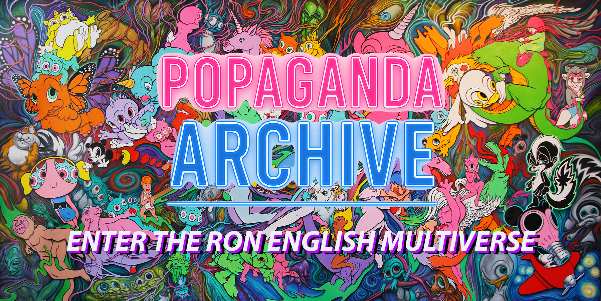
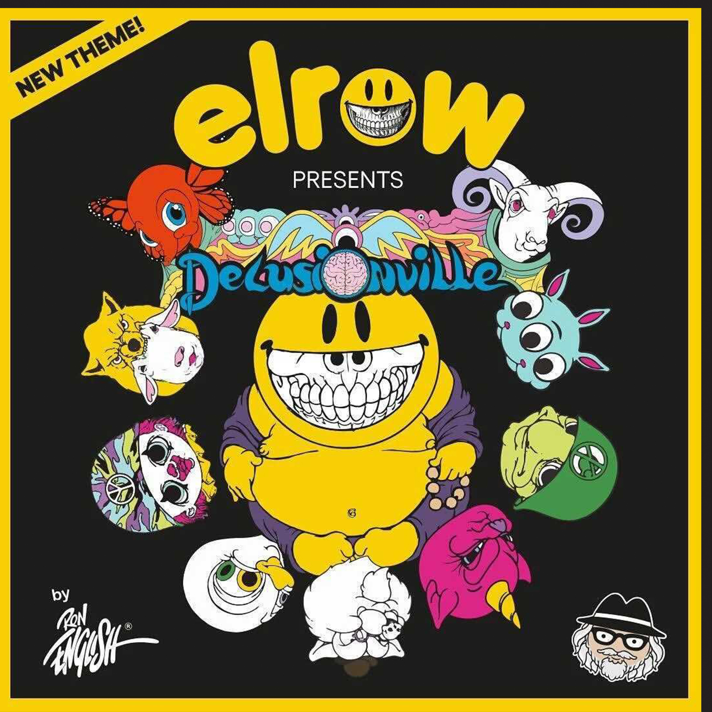
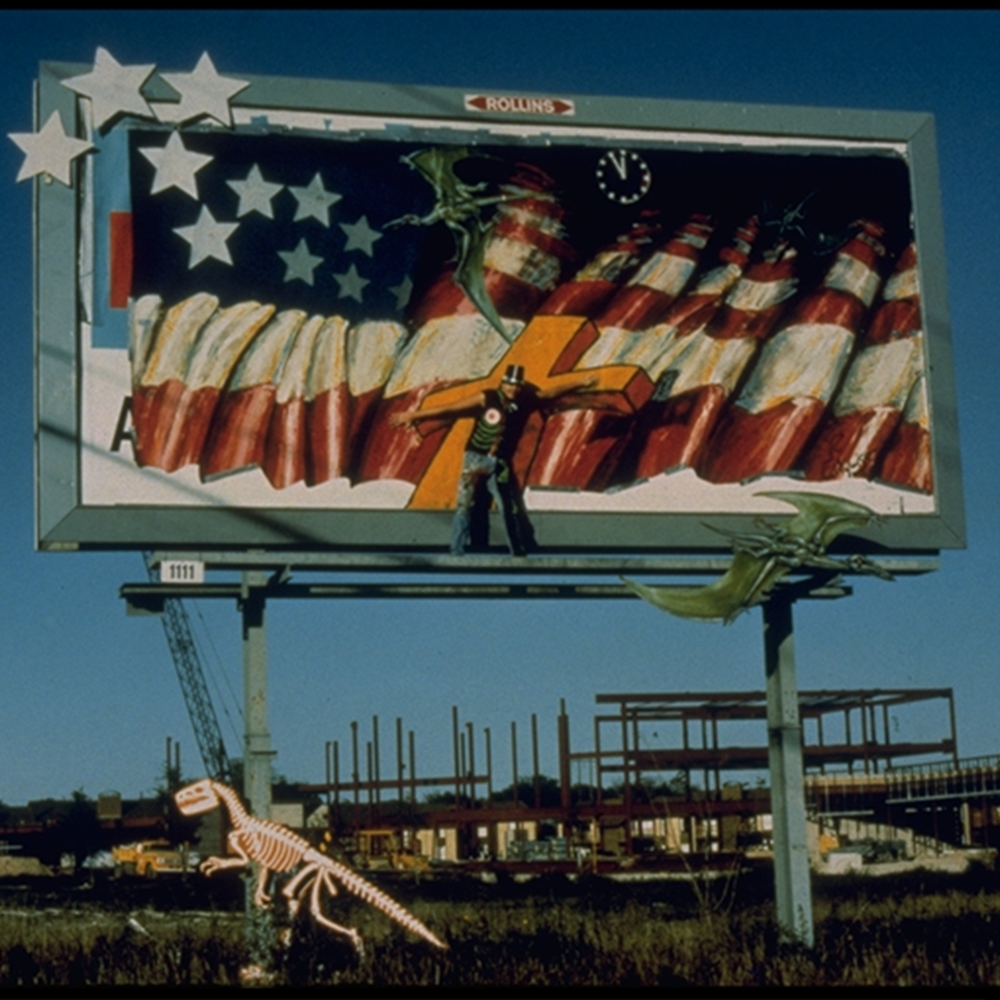

<!-- GLOBAL STYLES: keep page white -->

<!-- Main cursor dot -->

  

    <!-- BANNER -->
    

    <!-- 4 SECTION CARDS -->
    

      <!-- Exhibitions -->
      <section class="section-card">
        

          
        

        

          <h2 class="card-title">Exhibitions</h2>
          
Solo and group exhibitions organized by decade.

          

            <a class="action-link" href="exhibitions/solo-exhibitions.html">
              
              Enter exhibitions
            </a>
          

          

            <a class="sub-link" href="exhibitions/solo-exhibitions.html">
               Solo
            </a>
            <a class="sub-link" href="exhibitions/group-exhibitions.html">
               Group
            </a>
          

        

      </section>

      <!-- Murals -->
      <section class="section-card">
        

          
        

        

          <h2 class="card-title">Murals and Street Works</h2>
          
Public murals, street pieces, and related documentation.

          

            <a class="action-link" href="murals-and-street-works.html">
              
              Enter murals
            </a>
          

        

      </section>

      <!-- Events -->
      <section class="section-card">
        

          
        

        

          <h2 class="card-title">Public Appearances and Events</h2>
          
Talks, lectures, signings, benefits, and special events.

          

            <a class="action-link" href="special-events-parties-tours.html">
              
              Enter events
            </a>
          

          

            <a class="sub-link" href="public-talks-lectures-book-signings.html">
               Talks
            </a>
            <a class="sub-link" href="benefit-auctions-charity-projects.html">
               Benefits
            </a>
            <a class="sub-link" href="special-events-parties-tours.html">
               Special
            </a>
          

        

      </section>

      <!-- Projects -->
      <section class="section-card">
        

          
        

        

          <h2 class="card-title">Projects and Media</h2>
          
Pop-ups, brand activations, film events, and digital projects.

          

            <a class="action-link" href="digital-projects-nft-crypto-art.html">
              
              Enter projects
            </a>
          

          

            <a class="sub-link" href="pop-ups-shops-brand-activations.html">
               Pop-ups
            </a>
            <a class="sub-link" href="film-screenings-festivals-film-events.html">
               Film
            </a>
            <a class="sub-link" href="digital-projects-nft-crypto-art.html">
               Digital
            </a>
          

        

      </section>

    

  

