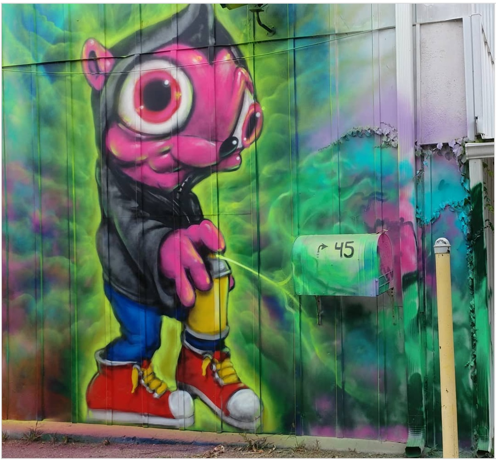

---

# 2018 – “Montana Mouse on the House” (Beacon Popmart)

**Year:** 2018  
**Location:** 45 Beekman Street, Beacon, New York, US  
**Event:** Beacon POP MART pop-up

This mural was painted for Ron English’s **Beacon POP MART** pop-up shop, which opened in late June 2018. The wall features a neon, oversized Montana Mouse character spraying paint directly toward the viewer — a playful nod to English’s long-running pop-surrealist universe and his Delusionville cast.

## Sources

- [Ron English – Instagram post (June 28, 2018)](https://www.instagram.com/p/BkqDlm7l2pE/)
- [Hudson Valley News / Beacon Events Coverage – Popmart opening listings](https://www.hvmag.com/calendar/)  
- [Beekman Street business listings confirming location](https://www.google.com/maps/place/45+Beekman+St,+Beacon,+NY/)

  [⬅ Back to murals index](../murals-and-street-works.html#beacon-popmart-2018-row)
