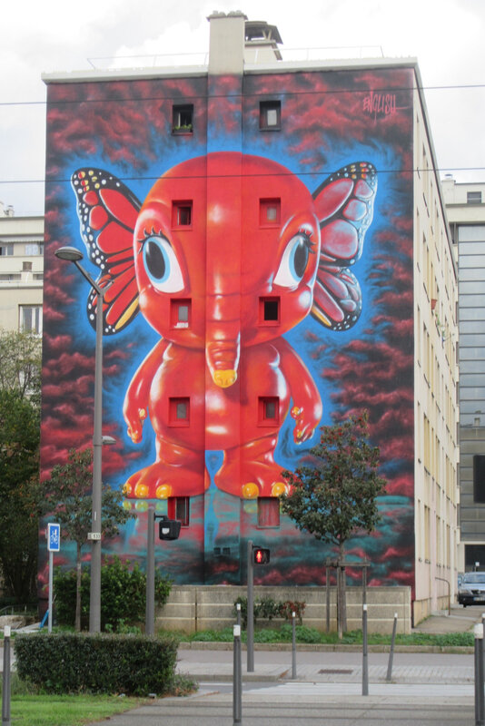

  <a href="../index.html">Home</a> ·
  <a href="../exhibitions/solo-exhibitions.html">Solo exhibitions</a> ·
  <a href="../exhibitions/group-exhibitions.html">Group exhibitions</a> ·
  <a href="../murals-and-street-works.html">Murals & street works</a> ·
  <a href="../pop-ups-shops-brand-activations.html">Pop-ups, shops & brand activations</a> ·
  <a href="../benefit-auctions-charity-projects.html">Benefit auctions & charity projects</a> ·
  <a href="../film-screenings-festivals-film-events.html">Film screenings, festivals & film events</a> ·
  <a href="../digital-projects-nft-crypto-art.html">Digital projects, NFT & crypto-art</a> ·
  <a href="../public-talks-lectures-book-signings.html">Public talks, lectures & book signings</a> ·
  <a href="../special-events-parties-tours.html">Special events, parties & tours</a>

---

[⬅ Back to murals index](../murals-and-street-works.html#elefanka-lyon-2019-row)

# 2019 – *Elefanka* (Lyon, France)

**Year:** 2019 (approx.)  
**Location:** Lyon, France  
**Program:** Large-format Lyon mural circuit

English’s *Elefanka* brought his hybrid-animal surrealism into Lyon’s growing ecosystem of XXL murals.  
Guides and walking-tour circuits list it as an unexpected POPaganda appearance among the city’s monumental façades, and local documentation from 2019–2020 confirms it as one of Lyon’s standout destinations for mural hunters exploring the expanding urban-art landscape.

---

## Main Image

---
## Sources

- [Ptit Loley – Lyon street art blog post](https://ptitloley.canalblog.com/archives/2019/11/06/37767436.html)
- [Street Art Safari – Lyon mural photo](https://www.street-art-safari.com/Picture@1120%E2%9C%AA)
- [Bleu Saturne – Balade street art Lyon](https://bleusaturne.wordpress.com/2020/01/23/balade-street-art-lyon/)
- [Lucky Sophie – Street art Murs XXL Lyon](https://www.luckysophie.com/2023/01/street-art-murs-xxl-a-lyon.html)

