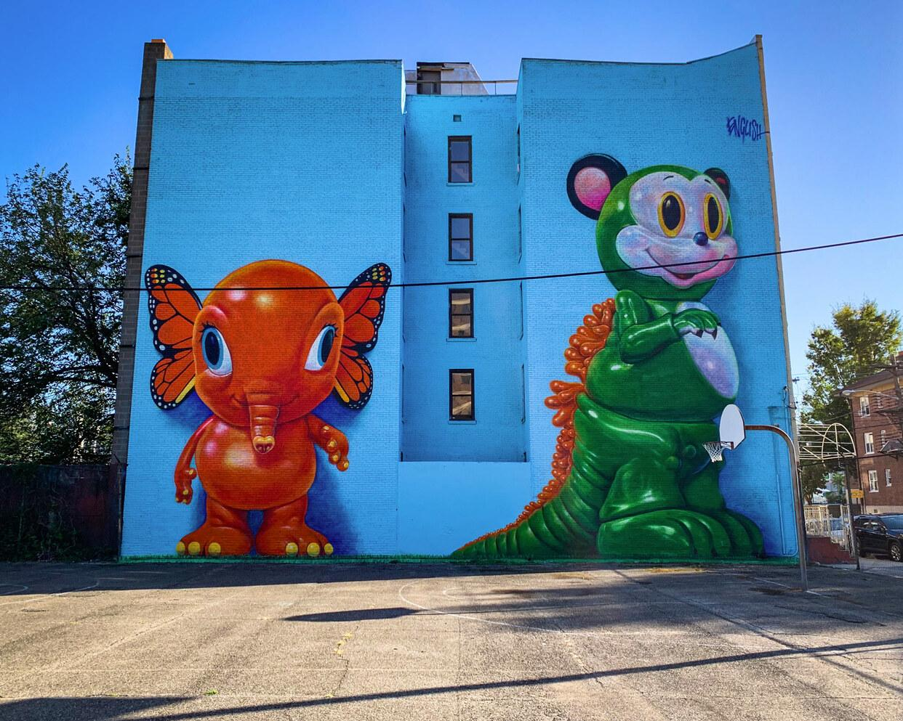

  <a href="../index.html">Home</a> ·
  <a href="../exhibitions/solo-exhibitions.html">Solo exhibitions</a> ·
  <a href="../exhibitions/group-exhibitions.html">Group exhibitions</a> ·
  <a href="../murals-and-street-works.html">Murals & street works</a> ·
  <a href="../pop-ups-shops-brand-activations.html">Pop-ups, shops & brand activations</a> ·
  <a href="../benefit-auctions-charity-projects.html">Benefit auctions & charity projects</a> ·
  <a href="../film-screenings-festivals-film-events.html">Film screenings, festivals & film events</a> ·
  <a href="../digital-projects-nft-crypto-art.html">Digital projects, NFT & crypto-art</a> ·
  <a href="../public-talks-lectures-book-signings.html">Public talks, lectures & book signings</a> ·
  <a href="../special-events-parties-tours.html">Special events, parties & tours</a>

---

[⬅ Back to murals index](../murals-and-street-works.html#elefanka-mousezilla-2019-row)

# 2019 – *Elefanka and Mousezilla* (Erie & 16th St., Jersey City)

**Year:** 2019  
**Location:** Erie Street basketball court, 266 Erie St, Jersey City  
**Program:** Jersey City Mural Arts Program

Commissioned as part of the Jersey City Mural Arts Program, this two-wall, sixty-foot installation pairs a butterfly-winged orange **Elefanka** with a towering green **Mousezilla**, both drawn from English’s *Delusionville* universe.  
Painted overlooking a neighborhood schoolyard, the mural became one of Jersey City’s signature POPaganda landmarks. Local press and mural-map guides note how English — then a Jersey City resident — helped shape the city’s early push to turn everyday corners into open-air galleries.

---

## Main Image

---

## Sources

*(Add URLs here — I can gather them for you if you want.)*

- Jersey City Mural Arts Program listings  
- Local press coverage of the Erie Street murals  
- Street-art photo documentation (Flickr, blogs, mural maps)
