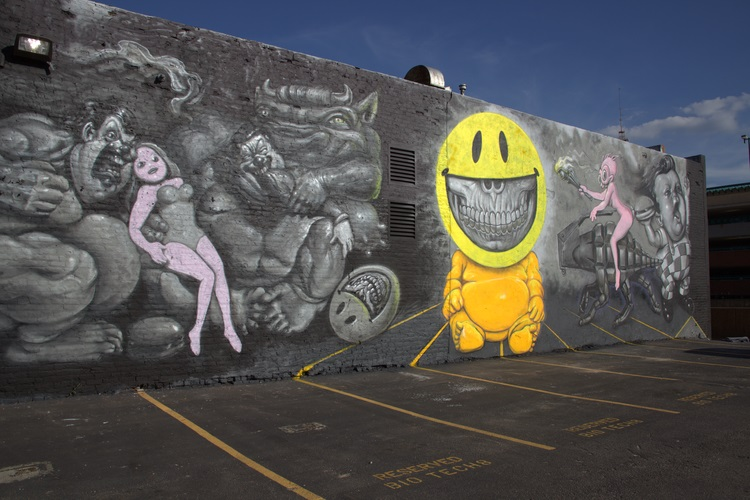

---

# 2014 – Grin Baby (Richmond Mural Project)  
**646 N 7th St, Richmond, Virginia, US**

**Year:** 2014  
**Location:** 646 N 7th St (Wall 2), Richmond, Virginia  

For the 2014 **Richmond Mural Project**, Ron English transformed a massive façade at 646 N 7th Street with an outsized **Grin Baby** head—its signature skull-toothed smile stretching across the wall and towering over the street below. The official festival map and Street Art Avenue’s documentation frame it as one of that year’s landmark installations. Local photographers and RVA Mag coverage capture how the wall became a recognizable #richmondmuralproject stop, marking an early large-scale East Coast showcase for English’s Grin Baby character.

---

## Images

---

## Sources

- [Street Art Avenue – Ron English at Richmond Mural Project](https://street-art-avenue.com/2014/06/ron-english-richmond-mural-project-usa-8125)
- [RVA Tourism – Richmond Mural Project map](https://www.rvatourism.com/richmond-mural-project-map/)
- [RVA Magazine – Ron English “Grin Baby”](https://rvamag.com/art/street-art/rva-street-art-ron-english-grin-baby.html)
- [Brooklyn Street Art – Richmond Mural Project coverage](https://www.brooklynstreetart.com/tag/richmond-mural-project/)
- [Instagram – #RichmondMuralProject](https://www.instagram.com/explore/tags/richmondmuralproject/)

[⬅ Back to murals index](../murals-and-street-works.html#grin-baby-richmond-2014-row)
