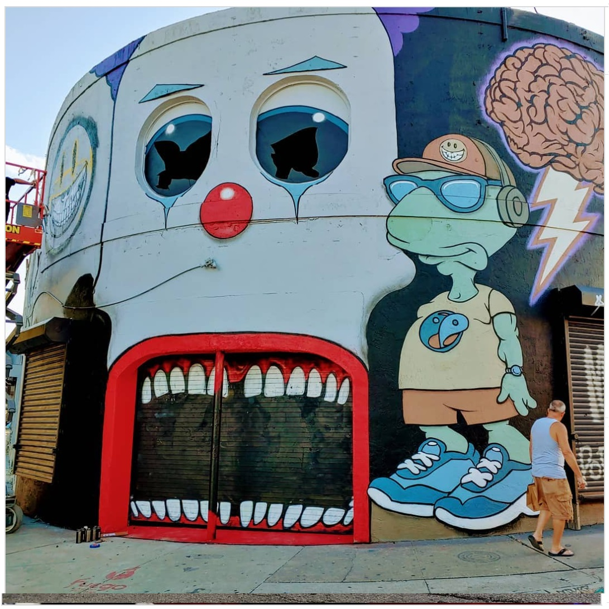

  <a href="../index.html">Home</a> ·
  <a href="../exhibitions/solo-exhibitions.html">Solo exhibitions</a> ·
  <a href="../exhibitions/group-exhibitions.html">Group exhibitions</a> ·
  <a href="../murals-and-street-works.html">Murals &amp; street works</a> ·
  <a href="../pop-ups-shops-brand-activations.html">Pop-ups, shops &amp; brand activations</a> ·
  <a href="../benefit-auctions-charity-projects.html">Benefit auctions &amp; charity projects</a> ·
  <a href="../film-screenings-festivals-film-events.html">Film screenings, festivals &amp; film events</a> ·
  <a href="../digital-projects-nft-crypto-art.html">Digital projects, NFT &amp; crypto-art</a> ·
  <a href="../public-talks-lectures-book-signings.html">Public talks, lectures &amp; book signings</a> ·
  <a href="../special-events-parties-tours.html">Special events, parties &amp; tours</a>

---

[⬅ Back to murals index](../murals-and-street-works.html#miami-popmart-2019-row)

# 2019 – Entrance mural for POP MART (Art Basel Miami)

**Year:** 2019  
**Location:** Wynwood, Miami, Florida, US  
**Event:** POP MART Delusionville pop-up (Art Basel Miami 2019)

## Sources

- [Ron English – Instagram post (Nov 30, 2019)](https://www.instagram.com/p/B5gMEi0lI6g/)
- [Miami New Times – Art Basel 2019 guide featuring POP MART](https://www.miaminewtimes.com/arts/art-basel-2019-guide-to-wynwood-art-events-11307720)
- [Widewalls – Art Basel Miami 2019 street art coverage](https://www.widewalls.ch/magazine/art-basel-miami-2019-street-art-wynwood)
- [Wynwood Official Events – POP MART Delusionville pop-up](https://wynwoodmiami.com/event/ron-english-popmart-delusionville/)
- [Arrested Motion – Ron English Art Basel 2019](https://arrestedmotion.com/tag/ron-english/)
