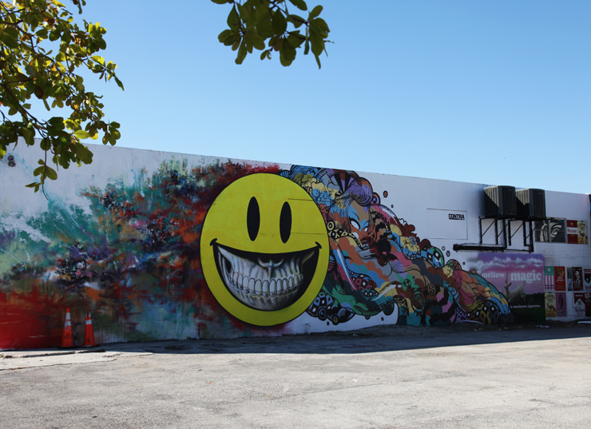

---

# 2010 – Contra Projects × Primary Flight collaborative mural  
**Wynwood, Miami (Art Basel week)**

**Year:** 2010  
**Location:** Wynwood (Primary Flight × Contra Projects), Miami, Florida, US  

Created for the 2010 Primary Flight program in partnership with Contra Projects, this large-scale collaboration brought together Ron English, Mr. Jago, Bask, Tes One, Tristan Eaton, and others during Art Basel Miami week. English’s smiling yellow icon anchors the wall, surrounded by psychedelic currents reflecting the visual signatures of the contributing Contra artists. Documentation from Primary Flight listings and Contra Projects coverage highlights how the piece captured the experimental, cross-pollinated energy that helped define Wynwood’s early street-art boom.

---

## Images

---

## Sources

- [Soul of Miami – Primary Flight street art murals](https://www.soulofmiami.org/2010/11/08/primary-flight-street-art-murals-1129-12510/)
- [Brooklyn Street Art – ContraProjects tag archive](https://www.brooklynstreetart.com/tag/contraprojects/)
- [Brooklyn Street Art – Primary Flight category archive](https://www.brooklynstreetart.com/category/primary-flight/)
- [Hypebeast – Ron English mural for “Status Factory” at Frank Doyle Arts Pavilion](https://hypebeast.com/2010/11/ron-english-status-factory-exhibition-mural-frank-doyle-arts-pavilion)
- [Vandalog – Fairey & Ron English in Miami](https://blog.vandalog.com/2010/11/12/fairey-ron-english-in-miami/)

[⬅ Back to murals index](../murals-and-street-works.html#primary-flight-2010-row)
