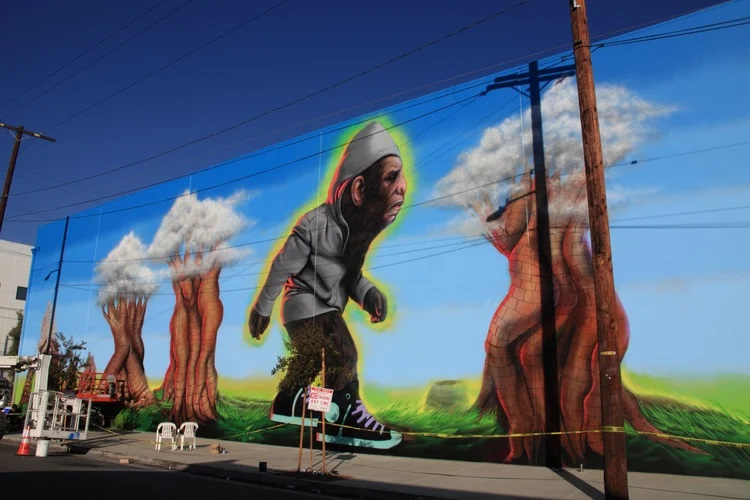

---

[⬅ Back to murals index](../murals-and-street-works.html#urban-bigfoot-la-row)

# 2010 – Urban Bigfoot (Los Angeles Freewalls)

**Year:** 2010  
**Location:** Los Angeles Arts District, Los Angeles, California, US  

One of the most recognizable works from the early **LA Freewalls** initiative, “Urban Bigfoot” blended Ron English’s POPaganda surrealism with the raw energy of the emerging Arts District. The towering figure became a photographer magnet and frequently appeared in media discussions about Los Angeles’ evolving relationship to street art. Coverage from LA Taco, Clutter Magazine, and PBS SoCal underscores how the mural helped define Freewalls as a pivotal moment in the transformation of the neighborhood from industrial zone to street-art hub.

---

## Images

---

## Sources

- [LA Taco – Urban Bigfoot & Ron English for LA Freewalls](https://lataco.com/urban-bigfoot-ron-english-la-freewalls)
- [Clutter Magazine – Progress on Ron English’s Urban Bigfoot mural](https://www.cluttermagazine.com/news/2013/11/progress-ron-englishs-urban-bigfoot-mural-la)
- [Clutter Magazine – Urban Bigfoot tag archive](https://www.cluttermagazine.com/tags/urban-bigfoot)
- [PBS SoCal – Mural citations and public art politics](https://www.pbssocal.org/history-society/mural-citations-are-off-the-wall-politics)
- [HuffPost – Street art: “It’s not meant to be permanent”](https://www.huffpost.com/entry/street-art-its-not-meant_b_5610496)
- [Daily Record – Best pictures from around the globe](https://www.dailyrecord.co.uk/news/uk-world-news/gallery/todays-best-pictures-around-globe-3767077)
- [YouTube – Urban Bigfoot mural video](https://www.youtube.com/watch?v=mA2RbTO0MdM)

